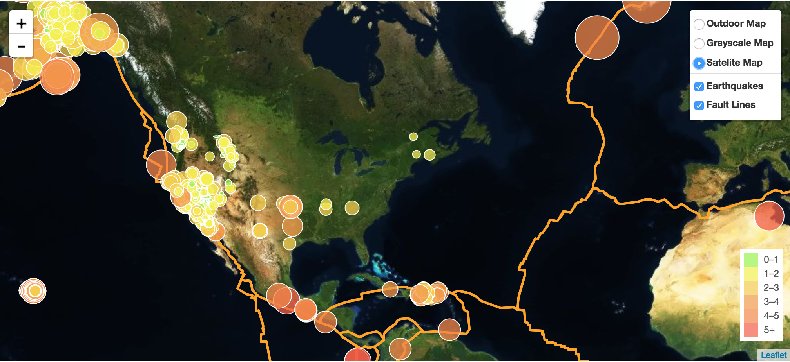
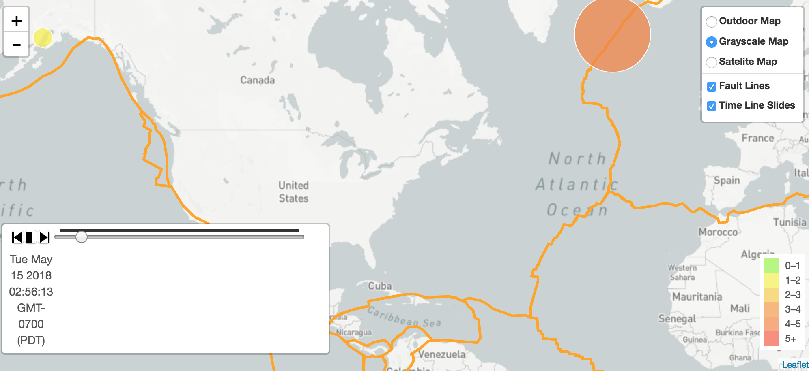
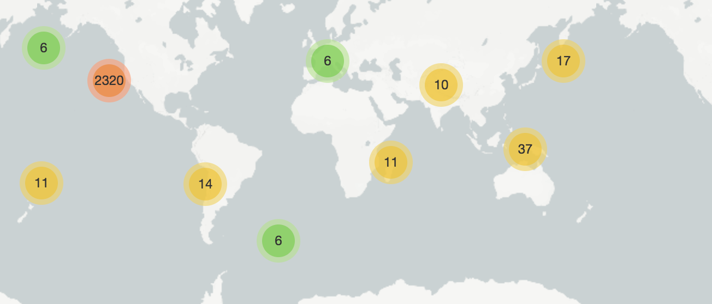
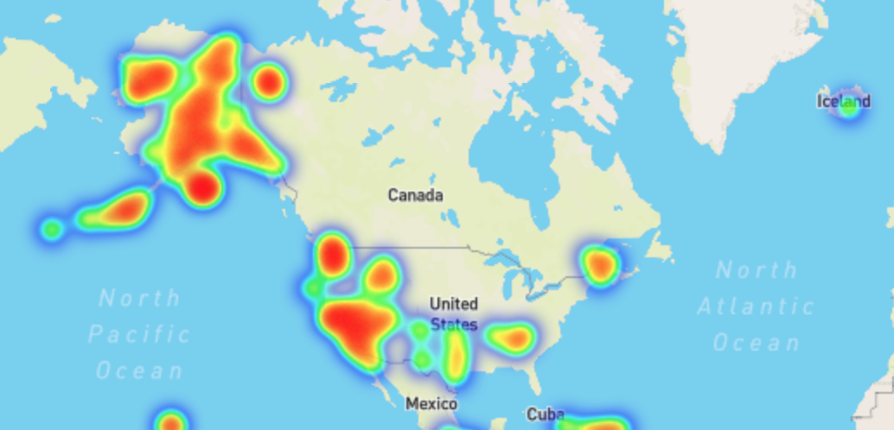

# Title: Earthquake visualization

## Background

### Step 1: Basic Visualization
- Explore data from USGS GeoJSON Feed](http://earthquake.usgs.gov/earthquakes/feed/v1.0/geojson.php) page, and pick "All Earthquakes from the Past 7 Days'. Used this URL of this JSON to pull in the data for our visualization. 
- Created a map using Leaflet.js with circle markers that relfect the magnitude of the earthquake in their size and color. Include popups information about the earthquake location, time and magnitude. 

### Step 2: Time Keeps on Ticking
- use timeline map plugin to visualize how many earthquakes happen over the course of a week. 

### Step 3: Cluster marker map and heat map 
- use cluster marker map and heat map to visualize earthquakes with magnitude over 4.5 over the past 7 days. 

### Sources Used:
- Earthquake data: https://earthquake.usgs.gov/earthquakes/feed/v1.0/geojson.php
- Fault Line data: "https://raw.githubusercontent.com/fraxen/tectonicplates/master/GeoJSON/PB2002_plates.json"
- Timeline plugin: https://github.com/skeate/Leaflet.timeline
- Cluster plugin: https://github.com/Leaflet/Leaflet.markercluster#using-the-plugin 

Github Webpage Link: https://weekysui.github.io/earthquake_map_visualization/
